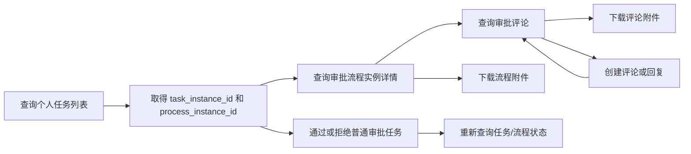

# User MCP 审批接口说明

本文说明合同开放平台本期新增的 6 个 User MCP 接口，以及它们在 `contract-cli` 中的命令映射、调用顺序和错误处理方式。原始接口定义来自[飞书接口目录](https://ysi13ckdb9.feishu.cn/wiki/X9b9wFf62itL2zkMYwrcDt9jnid)，本文以 2026-09-07 读取到的内容和当前 CLI 实现为准。

## 1. 接口总览

| 能力 | Method 与 Path | CLI 命令 | 操作语义 |
|---|---|---|---|
| 查询审批评论 | `GET /open-apis/contract/v1/mcp/process_instances/{process_instance_id}/comments` | `contract approval comment list` | 读取 |
| 下载合同文件 | `GET /open-apis/contract/v1/mcp/contracts/{contract_id}/files/{file_id}/download` | `contract download-file --as user` | 读取 |
| 查询审批流程实例详情 | `GET /open-apis/contract/v1/mcp/process_instances/{process_instance_id}` | `contract approval get --as user` | 读取 |
| 创建审批评论 | `POST /open-apis/contract/v1/mcp/process_instances/{process_instance_id}/comments` | `contract approval comment create` | 非幂等写入 |
| 查询个人任务列表 | `POST /open-apis/contract/v1/mcp/tasks` | `contract approval task list` | 读取 |
| 审批任务通过/拒绝 | `POST /open-apis/contract/v1/mcp/tasks/{task_instance_id}/approval` | `contract approval task approve/reject` | 非幂等写入 |

这 6 个接口都使用个人授权身份：

```http
Authorization: Bearer <user_access_token>
```

调用人、任务归属人、评论发起人都由 Token 唯一确定，不能通过 `user_id`、query 或请求体切换为其他用户。接口频率限制以开放平台统一频控配置为准。

## 2. 推荐调用链



推荐先查询本人任务，再读取流程和评论。只有用户明确表达通过或拒绝意图后，才调用任务处理接口；写操作返回结果不确定时，先查询最新状态，不要直接重试。

## 3. 通用响应和数据约定

默认响应为传统结构：

```json
{
  "code": 0,
  "msg": "success",
  "data": {},
  "success": true
}
```

- `code=0` 表示业务成功；不能只根据 HTTP 200 判断成功。
- 本期 user 审批详情、评论和任务命令在 `code != 0` 或 `success=false` 时保留响应输出，并以退出码 `1` 结束；`--raw` 同样检查业务状态。响应 JSON 非法或缺少有效 `code` 也返回失败。
- 上述命令的 stderr 仅输出错误摘要，完整业务错误信息保留在 stdout；业务失败不会触发自动重试。app 命令和其他既有 user 命令保持原有响应处理方式，文件下载沿用专用校验且不输出下载元数据。
- 审批意见 `--comment` 的日志值会脱敏；请求体仍发送完整意见。
- 流程、任务、评论、合同和文件 ID 应按字符串传输和保存。
- 当前接口中的 `tenant_id`、`contract_id`、`latest_process_event_sequence_id` 等长 ID 按 JSON String 返回；网关对外的人员 ID 也是 String，调用方不要转为 JavaScript Number。
- `110125` 通常同时表示资源不存在、当前用户不可见或当前状态不可操作。调用方不应利用该错误枚举资源是否存在。
- CLI 不在输出或日志中记录 Access Token、临时上传/下载地址等敏感信息。

## 4. 查询审批流程实例详情

```http
GET /open-apis/contract/v1/mcp/process_instances/{process_instance_id}
```

权限要求：当前个人用户对审批实例关联合同具有读取权限。

### 请求参数

| 位置 | 字段 | 类型 | 必填 | 说明 |
|---|---|---|---|---|
| Path | `process_instance_id` | String | 是 | 合同审批流程实例 ID |
| Query | `task_instance_filter` | String | 否 | 任务实例 ID；多个值用英文逗号分隔 |
| Query | `notice_filter` | String | 否 | 知会记录 ID；多个值用英文逗号分隔 |
| Header | `X-MCP-Response-Profile` | String | 否 | 不传时为 `clm-web-status-v1.0` |

支持的响应 Profile：

| Profile | 行为 |
|---|---|
| 不传或 `clm-web-status-v1.0` | `code/msg/data` 结构，业务错误通常仍为 HTTP 200 |
| `clm-web-status-v2.0` / `v2.1` | 传统结构，业务错误映射为非 2xx HTTP 状态 |
| `clm-mcp-outcome-v1.0` | `io.unbox/provider-outcome@1` 结构，HTTP 状态固定为 200 |

当前 CLI 不主动发送 `X-MCP-Response-Profile`，保持服务端默认兼容模式。

### 主要响应字段

`data.process_instance` 包含：

| 字段 | 类型 | 说明 |
|---|---|---|
| `process_instance_id` | String | 流程实例 ID |
| `process_definition_id` / `process_definition_key` | String | 流程定义标识 |
| `instance_status` | String | 流程状态 |
| `biz_key` | String | 关联业务单据标识，合同场景通常为合同 ID |
| `initiator_id` | String | 流程发起人开放平台 ID |
| `start_time` / `end_time` | String | 毫秒时间戳字符串；未结束时 `end_time` 可能为空 |
| `process_subject` / `process_name` | Object | `zh/en/ja` 多语言文案 |
| `task_instance_list` | Object[] | 流程实际产生的任务实例 |
| `notice_list` | Object[] | 知会记录 |
| `complete` | Boolean | 返回信息是否完整；`false` 表示部分信息无法可靠还原 |
| `limitations` | String[] | 不完整原因，调用方必须保留并展示 |

任务实例的重点字段：

| 字段 | 类型 | 说明 |
|---|---|---|
| `task_instance_id` | String | 后续审批动作使用的任务 ID |
| `node_id` / `node_name` | String / Object | 节点标识和多语言名称 |
| `assignee_ids` | String[] | 审批人开放平台 ID |
| `assignee_user_ids` | String[] | 审批人开放平台 ID，可能不返回 |
| `command_type` / `command_type_name` | String / Object | 审批动作及其多语言名称 |
| `task_comment` | String | 审批意见，可能为空 |
| `attachments` | Object[] | 审批附件，可能省略 |
| `task_status` | Integer | 任务状态，无法补齐时不返回 |

迁移流程可能以 `code=0` 返回部分成功：`data.process_instance.complete=false`，并通过 `limitations` 标识 `MIGRATED_TASK_STATUS_UNAVAILABLE` 或 `MIGRATED_ATTACHMENTS_NOT_VERIFIABLE`。CLI 保留这些字段，不把部分成功改成失败；缺失状态或附件不等于任务已结束或没有附件。

`task_status` 枚举：`0` 运行中、`1` 已完成、`2` 已拒绝、`3` 已撤回、`4` 已撤销、`5` 自动终止。字段缺失时表示状态未知，不要根据 `end_time`、`command_type` 或审批意见推断。

### CLI 示例

```bash
contract-cli contract approval get <process-instance-id> \
  --profile contract --as user \
  --task-instance-filter <task-id-1>,<task-id-2>
```

## 5. 查询审批评论

```http
GET /open-apis/contract/v1/mcp/process_instances/{process_instance_id}/comments
```

权限要求：当前用户具有审批实例关联合同的查看权限。

接口没有 query 和分页参数，一次返回完整递归评论树。一级评论位于 `data.items`，回复位于每个评论的 `replies`，回复结构与一级评论相同。

### 主要响应字段

| 字段 | 类型 | 说明 |
|---|---|---|
| `data.process_instance_id` | String | 审批实例 ID |
| `data.contract_id` | String | 关联合同 ID，可用于下载评论附件 |
| `items[].comment_id` | String | 评论 ID |
| `items[].parent_comment_id` | String | 父评论 ID；一级评论为 `null` |
| `items[].content` | String | 包含已渲染 @ 用户文本的评论正文 |
| `items[].author` | Object | `user_id`、`name` |
| `items[].mentions` | Object[] | 被 @ 用户的 `user_id`、`name` 和正文 `offset` |
| `items[].create_time` / `update_time` | Long | 毫秒时间戳 |
| `items[].is_deleted` | Boolean | 评论是否已删除 |
| `items[].attachments` | Object[] | 当前节点直接关联的附件 |
| `items[].replies` | Object[] | 直接回复，可继续递归 |

附件包含 `file_id`、`file_name`、`file_size`、`mime_type`、`available`。只有 `available=true` 时才应调用下载接口；已删除评论可能仍保留在树中，以维持回复关系。

### CLI 示例

```bash
contract-cli contract approval comment list <process-instance-id> \
  --profile contract --as user
```

## 6. 创建审批评论

```http
POST /open-apis/contract/v1/mcp/process_instances/{process_instance_id}/comments
Content-Type: application/json
```

评论发起人固定为个人 Token 对应用户。`user_id_type` 只解释被 @ 用户的 ID 类型，不指定评论发起人。

### 请求参数

| 位置 | 字段 | 类型 | 必填 | 说明 |
|---|---|---|---|---|
| Path | `process_instance_id` | String | 是 | 合同审批实例 ID |
| Query | `user_id_type` | String | 否 | `user_id` 数组的 ID 类型；默认 `open_id` |
| Body | `content` | String | 否 | 普通正文；存在 @ 用户时不需要手工拼接 `@姓名` |
| Body | `parent_comment_id` | String | 否 | 被回复的评论 ID；不传时创建一级评论 |
| Body | `user_id` | String[] | 否 | 被 @ 用户列表，类型由 `user_id_type` 决定 |
| Body | `file_ids` | String[] | 否 | 当前用户新上传并提交的 `reviewAttachment`，或当前合同中该用户可见的已有文件 ID |
| Body | `task_instance_id` | String | 否 | 仅用于评论通知跳转兜底 |

字段名固定为 `user_id`，且值必须为数组；不能使用 `user_ids`、`at_user_ids` 或 `at_info_list` 代替。接口会按数组顺序生成 @ 用户文本及位置。

请求示例：

```json
{
  "content": "请查看补充材料",
  "parent_comment_id": "112233445566778899",
  "user_id": ["ou_10001", "ou_10002"],
  "file_ids": ["223344556677889900"],
  "task_instance_id": "task-instance-001"
}
```

成功响应的 `data` 包含 `comment_id`、`process_instance_id` 和 `business_id`。

### CLI 示例

```bash
contract-cli contract approval comment create <process-instance-id> \
  --profile contract --as user \
  --mention-id-type open_id \
  --data '{"content":"请确认审批意见","user_id":["ou_10001"]}'
```

该接口非幂等，重复调用会创建多条评论。遇到超时、网络中断或 CLI 返回“执行结果不确定，请先查询确认”时，应先调用评论查询接口确认结果。

## 7. 查询个人任务列表

```http
POST /open-apis/contract/v1/mcp/tasks
Content-Type: application/json
```

虽然使用 POST，该接口仍是读取操作，只查询 Token 对应用户的待办、已办或抄送/知会任务。直接调用 API 时至少发送空 JSON 对象 `{}`。

### 请求体

| 字段 | 类型 | 默认值 | 说明 |
|---|---|---|---|
| `query` | String | - | 合同名称、合同编号或申请人名称 |
| `task_type_code` | Integer | `0` | `0` 待办、`1` 已办、`2` 抄送/知会 |
| `business_type_codes` | Integer[] | - | 单据业务类型编码 |
| `desc` | Boolean | `true` | 是否按任务时间倒序 |
| `read` | Boolean | - | 知会是否已读，仅类型 `2` 生效 |
| `only_urge` | Boolean | - | 是否仅查询被催办任务，仅类型 `0` 生效 |
| `task_instance_id` | String | - | 待办或已办任务游标 |
| `notice_id` | String | - | 抄送/知会游标 |
| `page_index` | Integer | `0` | 从 0 开始的页码 |
| `page_size` | Integer | `10` | 每页 `1-100` 条 |
| `limit_before` / `limit_after` | Integer | - | 游标前后的任务数量 |
| `node_types` | Integer[] | - | 审批节点类型 |
| `check_cursor_status` | Boolean | `true` | 是否校验游标状态和任务类型匹配 |
| `legal_entity_source_ids` | String[] | - | 我方主体来源 ID |
| `trading_party_source_ids` | String[] | - | 对方主体来源 ID |

CLI 为常用字段提供 `--query`、`--task-type todo|done|notice`、`--page-index`、`--page-size`；其他筛选条件通过 `--input-file` 或 `--data` 传入，命令行 flag 会覆盖 JSON 中的同名字段。

### 主要响应字段

`data` 包含 `task_list`、`total`、`page_index`、`page_size` 和 `has_more`。任务项重点字段如下：

| 字段 | 类型 | 说明 |
|---|---|---|
| `contract_id` | String | 合同 ID，保持字符串 |
| `contract_name` / `contract_number` | String | 合同标题和单号 |
| `applicant_user_id` | String | 申请人开放平台 ID |
| `task_instance_id` | String | 审批任务 ID；知会任务为空 |
| `notice_id` | String | 知会 ID；待办、已办任务为空 |
| `task_type` | Integer | `0` 待办、`1` 已办、`2` 抄送/知会 |
| `process_instance_id` | String | 流程实例 ID |
| `node_name` | String | 任务节点名称 |
| `timestamp` | Long | 任务时间戳，毫秒 |

### CLI 示例

```bash
contract-cli contract approval task list \
  --profile contract --as user \
  --task-type todo --query "采购合同" --page-size 20
```

盖章和归档任务可能出现在列表中，但不能使用下一个接口处理。

## 8. 审批任务通过或拒绝

```http
POST /open-apis/contract/v1/mcp/tasks/{task_instance_id}/approval
Content-Type: application/json
```

权限要求：当前用户是运行中任务的办理人，并具备首页、合同管理或任务中心中的任一功能权限。

### 请求体

| 字段 | 类型 | 必填 | 说明 |
|---|---|---|---|
| `action` | String | 是 | `approve` 或 `reject`，大小写不敏感 |
| `comment` | String | 条件必填 | `reject` 时必填且不能为空白；`approve` 时选填 |
| `file_ids` | String[] | 否 | `approveAttachment` 类型的审批附件 ID |
| `archive_number` | String | 否 | 兼容保留字段；MCP 当前不处理归档节点，无需传入 |

`file_ids` 中每个 ID 必须是正整数且属于当前租户：可以是当前用户通过 MCP 上传且 commit 后未超过 30 分钟的 `approveAttachment`，也可以是已关联当前审批业务的 `approveAttachment`；重复 ID 按首次出现顺序去重。

通过示例：

```json
{
  "action": "approve",
  "comment": "同意",
  "file_ids": ["6911661136408477999"]
}
```

拒绝示例：

```json
{
  "action": "reject",
  "comment": "合同条款风险尚未解决，请修改后重新提交"
}
```

成功响应包含 `task_instance_id`、`process_instance_id`、实际 `action` 和动作后的 `process_status`。

### CLI 示例

```bash
contract-cli contract approval task approve <task-instance-id> \
  --profile contract --as user --comment "同意" \
  --file-id 6911661136408477999

contract-cli contract approval task reject <task-instance-id> \
  --profile contract --as user \
  --comment "合同条款风险尚未解决"
```

本接口只处理普通审批节点，不支持盖章和归档节点，也不支持转办、加签、撤回、作废等动作。它不是幂等接口；成功后重复调用会返回不可操作。出现“执行结果不确定”时，先重新查询任务列表或流程详情。

## 9. 下载合同文件

```http
GET /open-apis/contract/v1/mcp/contracts/{contract_id}/files/{file_id}/download
```

权限要求：当前用户具有合同读取权限，并具备合同管理或任务中心中的任一功能权限。`contract_id`、`file_id` 都必须是正整数且在 Long 范围内，文件必须属于该合同的可见文件集合。

可下载范围包括合同正文、用印前文件、普通附件、扫描件、表单自定义附件、内部模板附件、评论/审批附件、最新用印 OCR 对比文件及归档附件。不支持其他合同文件、外部模板附件或不可见文件。

### 响应字段

接口返回 JSON 元数据，不直接返回二进制：

| 字段 | 类型 | 说明 |
|---|---|---|
| `data.file_id` | String | 文件 ID |
| `data.file_name` | String | 文件名称 |
| `data.file_size` | Long | 文件记录中的大小，字节；历史记录可能与当前下载对象不一致 |
| `data.mime_type` | String | MIME 类型 |
| `data.file_type` | String | 文件业务类型 |
| `data.expires_in_seconds` | Integer | 下载地址有效期，固定 `300` 秒 |
| `data.download_url` | String | TOS 临时预签名 URL |

CLM 在签发地址前校验当前用户合同权限及文件归属，再通过对象存储生成 300 秒预签名 URL；不再提供应用层 ticket 兑换接口。CLI 应原样使用 URL，包括签名查询参数和转义字符，不拼接开放平台参数。

获取成功响应后，应在有效期内直接访问 `download_url`。第二次请求不携带开放平台 `Authorization`；临时地址不得打印、持久化或转发给无权限人员。

当前 CLI 会自动完成两段下载流程：校验 HTTPS 地址、发起无授权请求、检查 HTTP 状态和流完整性；优先按实际响应 `Content-Length`（包括 0）校验字节数，缺少该长度时回退到 `file_size`，普通文件模式先写同目录临时文件，完整成功后再提交目标文件。

```bash
contract-cli contract download-file <file-id> \
  --contract <contract-id> \
  --profile contract --as user \
  --output-file ./附件.pdf
```

`--raw` 会把二进制直接写到 stdout：

```bash
contract-cli contract download-file <file-id> \
  --contract <contract-id> \
  --profile contract --as user --raw > 附件.pdf
```

### 新评论、审批附件的上传前置流程

`reviewAttachment` 和 `approveAttachment` 是上传用途，分别用于新评论附件和新审批附件；关联到合同业务后，两者都使用上述统一下载接口。

```bash
contract-cli contract upload-file --profile contract --as user --file ./评论附件.pdf --file-type reviewAttachment
contract-cli contract upload-file --profile contract --as user --file ./审批附件.pdf --file-type approveAttachment
```

CLI 对这两类 user 上传自动执行：

1. `POST /open-apis/contract/v1/mcp/files/upload_sessions/prepare`，以当前 user Token 发送 `file_name`、`file_type`；响应包含 `upload_id`、`upload_url`、`upload_method`、`upload_headers`、`expires_at`、`max_size`。
2. 校验有效期、服务端大小限制，以及当前协议的 HTTPS、POST 和空 headers，向临时 `upload_url` 发送仅含 `file` 的 multipart 流；不携带 Authorization/Cookie，不跟随重定向。
3. `POST /open-apis/contract/v1/mcp/files/upload_sessions/commit`，以同一 user 身份发送 `upload_id`。只有 commit 业务成功且有有效 `file_id` 才输出最终响应。

文件必须非空，并满足 CLI 的 200MB 与服务端 `max_size` 限制。任一步失败即停止，不自动重试，也不输出临时地址、会话 ID 或未确认的文件 ID。网络/5xx 或上传后响应无法确认时提示“执行结果不确定”；不要直接提交评论/审批，应先确认上传结果或重新准备附件。

新附件授权要求同租户、同用户，commit 后有效期为 30 分钟。普通 app 上传不能代替这项 user 授权。已有当前合同可见文件可复用于评论；已有当前审批业务的 `approveAttachment` 可复用于审批，无需为复用而重复上传。

app 上传及 user 的其他 `file_type` 继续使用原 `POST /open-apis/contract/v1/files/upload`；这两类 MCP 上传不使用 `--user-id` / `--user-id-type` 指定调用人。

## 10. 错误码汇总

| 业务码 | 典型场景 | 建议 |
|---|---|---|
| `110000` | 任务查询或处理参数非法 | 检查任务类型、分页、action、comment 和附件 ID |
| `110001` | 下载接口没有有效个人登录身份 | 重新完成 user 授权 |
| `110002` | 系统、BPM 或文件存储链路异常 | 读接口可稍后重试；写接口先查询状态 |
| `110004` | 个人身份无效，或附件不满足当前用户授权/业务归属要求 | 检查 user Token、上传用途、同用户 commit、30 分钟有效期和已有文件归属 |
| `110125` | 流程、合同、文件、任务不存在、不可见或不可操作 | 重新查询本人可见资源，不区分不存在和无权限 |
| `110507` | 盖章或归档任务不支持 MCP 审批 | 转到合同系统页面处理 |
| `110509` | 合同、流程或下游状态不允许该动作 | 根据返回信息检查最新状态 |
| `110602` | 评论写入失败 | 查询评论确认是否成功，再决定后续处理 |
| `110603` | 评论内容超过系统长度限制 | 缩短评论正文 |
| `110903` | 无有效个人身份，或被 @ 用户无效/不属于租户 | 检查授权和 `user_id_type/user_id` |
| `111706` | 下载路径 ID 非正整数或超出 Long 范围 | 修正 `contract_id` / `file_id` |

评论创建还可能返回公共参数错误码，涵盖请求体格式、父评论、附件 ID 或 @ 用户转换错误。

## 11. CLI 重试和幂等策略

| 操作 | CLI 策略 |
|---|---|
| 流程详情、评论列表、下载元数据 | 按读取操作处理，临时网络错误最多自动重试一次 |
| 个人任务列表 | 虽是 POST，仍声明为读取操作，临时网络错误最多自动重试一次 |
| 创建评论 | 非幂等写入，不自动重试；网络错误或 5xx 返回“执行结果不确定” |
| 任务通过/拒绝 | 非幂等写入，不自动重试；网络错误或 5xx 返回“执行结果不确定” |
| TOS 临时预签名 URL 的二次文件请求 | 不携带 Token，不输出 URL；失败后重新执行命令获取新地址 |

## 12. 联调检查清单

- 使用 user profile 和有效个人授权，不使用纯 app Token 调用 MCP 路径。
- 验证当前用户对合同、流程或任务确实可见，不向调用方区分“不存在”和“无权限”。
- 所有长 ID 使用字符串或无损整数处理，避免 JavaScript 精度丢失。
- 评论 @ 用户时确认 `user_id_type` 与 `user_id` 数组一致。
- 新评论附件按 `reviewAttachment`、新审批附件按 `approveAttachment` 用同一 user 身份上传；使用 commit 返回的 `file_id`，在 30 分钟内提交评论/审批。已有附件按当前业务可见性与类型校验。
- 只对普通审批节点调用 approve/reject；盖章和归档节点转页面处理。
- 写操作超时后先查询，不盲目重复提交。
- 下载地址仅短期使用，不进入日志、数据库、缓存或对外响应。

流程详情与个人任务列表的 user 请求固定携带 `user_id_type=user_id`，与合同查询一致，避免网关缺省 `open_id` 与组织服务人员 ID 转换不兼容。该参数决定响应人员 ID 类型，不改变当前用户身份或权限。
